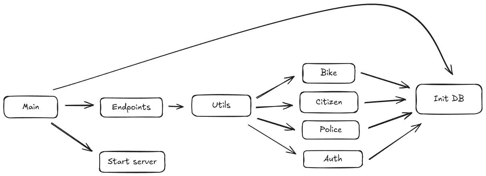

# Catalog of stolen bikes

## Overview

A simple Go server to use for cataloging stolen bikes. This application is deployed with Docker. 

## Requirements

 - Docker compose 

## Architectural Overview


### Description of architecture
The entry point (main) begins by initializing the database. Once initialization is complete, the server's endpoints are registered. The functions associated with each endpoint are fetched from the utils directory, which contains several utility files organized by specific domains. Each utility file uses the initialized database to perform queries. After this setup process is complete, the main file starts the server.

## Quick Start
From root directory

```bash
./start-server.sh
```
or 
```bash
docker compose up -d --build
```
This starts the server and database. The endpoints are accesible from localhost:8080

## API Documentation

## API Documentation

### Base URL
```
/api
```

## Endpoints

### Police
Base URL: `/api/police`

- **GET /** - Retrieve all police records
- **POST /** - Create a new police record
- **PATCH /:id** - Update a police record by ID
- **DELETE /:id** - Delete a police record by ID

### Citizen
Base URL: `/api/citizen`

- **GET /** - Retrieve all citizen records
- **POST /** - Create a new citizen record

### Bike
Base URL: `/api/bike`

**Middleware**: Requires authentication (`utils.AuthMiddleware()`)

- **GET /** - Retrieve all bikes
- **POST /** - Report a stolen bike
- **GET /found/:id** - Mark a bike as found by ID and unassign the police officer

### Login
Base URL: `/login`

- **POST /citizen** - Authenticate a citizen and return a session/token

## Authentication

### Middleware: `AuthMiddleware`

- Checks for a valid `jwt_token` cookie
- Parses and validates the token
- Retrieves the associated citizen from the database
- Attaches the citizen object to the request context

### JWT Generation (`generateJWT`)

- Generates a JWT token valid for 24 hours
- Contains `email` and `user_id` claims

### Citizen Login (`LoginCitizen`)

- Accepts JSON payload:
  ```json
  {
    "email": "user@example.com",
    "password": "password123"
  }
  ```
- Validates credentials and finds the citizen
- Verifies password
- Generates a JWT token on successful login

## Bike Management

### Report Stolen Bike (`CreateBike`)

- Accepts JSON payload:
  ```json
  {
    "description": "Black mountain bike",
    "citizen_id": 1
  }
  ```
- Verifies that the citizen exists
- Attempts to assign an available police officer to the stolen bike
- Creates a new bike record in the database
- Responds with:
  ```json
  {
    "message": "Stolen bike reported and assigned to police",
    "bike_id": 10,
    "assigned_to_police_id": 3
  }
  ```

### Retrieve All Bikes (`GetAllBikes`)

- Returns a list of all bikes, including associated citizens and police officers:
  ```json
  {
    "bikes": [
      {
        "id": 1,
        "description": "Red road bike",
        "found": false,
        "citizen": { "id": 1, "name": "John Doe" },
        "police": { "id": 2, "name": "Officer Jane" }
      }
    ]
  }
  ```

### Mark Bike as Found (`FoundBike`)

- Marks a bike as found and unassigns the police officer
- Attempts to reassign the freed-up police officer to another unassigned stolen bike
- Responds with:
  ```json
  {
    "message": "Bike marked as found and police officer unassigned"
  }
  ```


